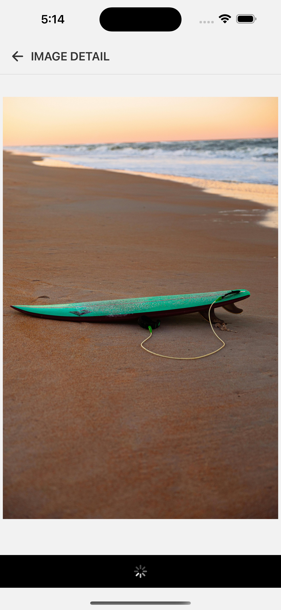
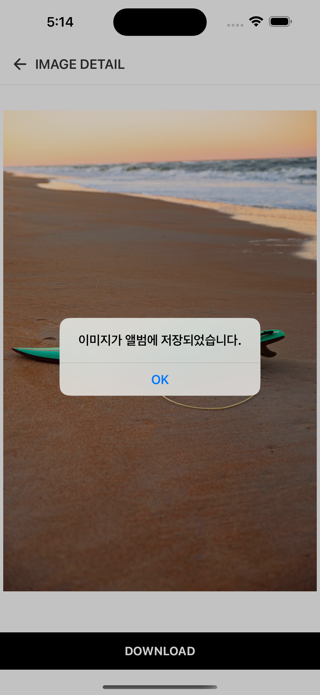

# Wallpaper Download App

React Native로 개발된 배경화면 갤러리 앱입니다. Expo를 기반으로 하며, 이미지 목록 조회와 다운로드 기능을 제공합니다.

## 화면

| | | |
|---|---|---|
|  |  |  |
|  | | |

## 주요 기능

- **이미지 갤러리**: Pexels 이미지 API를 활용한 고품질 배경화면 목록
- **이미지 상세보기**: 개별 이미지 확대 보기 및 상세 정보
- **이미지 다운로드**: 디바이스 사진 앨범에 이미지 저장 기능
- **탭 내비게이션**: Bottom Tab을 통한 직관적인 화면 전환

## 기술 스택

### Frontend
- **React Native 0.79.6**: 크로스 플랫폼 모바일 앱 개발
- **Expo SDK 53**: 개발 도구 및 네이티브 API 접근
- **TypeScript**: 타입 안정성 확보

### Navigation
- **React Navigation 7**: 화면 네비게이션 관리
- **Bottom Tabs**: 탭 기반 네비게이션
- **Stack Navigation**: 스택 기반 화면 전환

### State Management & Hooks
- **Custom Hooks**: 비즈니스 로직 캡슐화
- **useImageDetail**: 이미지 다운로드 로직 관리
- **usePhotoListItem**: 이미지 리스트 아이템 상태 관리

### UI Components
- **Design System**: 재사용 가능한 컴포넌트 시스템
- **Typography**: 일관된 텍스트 스타일링
- **Icons**: 벡터 아이콘 시스템

### Media & File System
- **expo-file-system**: 파일 다운로드 및 관리
- **expo-media-library**: 디바이스 미디어 라이브러리 접근

## 📁 프로젝트 구조

```
app/
├── _layout.tsx                    # 루트 레이아웃
└── src/
    ├── components/               # 재사용 가능한 컴포넌트
    │   └── PhotoListItem.tsx    # 이미지 리스트 아이템
    ├── data/                    # 데이터 및 상수
    │   └── constants.ts         # 이미지 URL 목록
    ├── designsystem/            # 디자인 시스템 컴포넌트
    │   ├── Badge.tsx
    │   ├── Button.tsx
    │   ├── Header.tsx
    │   ├── Icons.tsx
    │   ├── RemoteImage.tsx
    │   └── Typography.tsx
    ├── hooks/                   # 커스텀 훅
    │   ├── useImageDetail.ts    # 이미지 다운로드 로직
    │   └── usePhotoListItem.ts  # 리스트 아이템 상태 관리
    ├── navigation/              # 네비게이션 설정
    │   ├── BottomTabNavigations.tsx
    │   └── RootStackNavigations.tsx
    └── screen/                  # 화면 컴포넌트
        ├── ImageListScreen.tsx      # 이미지 목록 화면
        ├── ImageDetailScreen.tsx    # 이미지 상세 화면
        ├── FavoriteImageListScreen.tsx # 즐겨찾기 화면
        └── components/
            └── DownloadButton.tsx   # 다운로드 버튼
```


## 주요 기능 구현

### 이미지 다운로드 (useImageDetail Hook)

```typescript
const useImageDetail = () => {
  const [isDownloading, setIsDownloading] = useState(false);
  
  // 권한 확인 및 요청
  // 이미지 다운로드
  // 미디어 라이브러리에 저장
  
  return { onPressDownload, isDownloading };
};
```

### 주요 특징:
- **권한 관리**: 미디어 라이브러리 접근 권한 자동 요청
- **에러 처리**: 다운로드 실패 시 사용자 친화적 알림
- **로딩 상태**: 다운로드 진행 상태 UI 피드백
- **파일 시스템**: Expo File System을 활용한 안전한 파일 다운로드

## 🔒 권한 설정

앱이 정상적으로 동작하기 위해 다음 권한이 필요합니다:

- **CAMERA_ROLL**: 이미지를 디바이스 갤러리에 저장
- **WRITE_EXTERNAL_STORAGE**: 안드로이드에서 외부 저장소 접근

## 📖 학습 내용 정리

이 프로젝트를 통해 학습할 수 있는 React Native 개발 개념들:

### 1. React Native
- 컴포넌트 기반 개발
- StyleSheet를 활용한 스타일링

### 2. Navigation
- React Navigation 설정 및 사용
- Stack Navigation과 Tab Navigation 조합
- 타입 안정성을 고려한 네비게이션 파라미터 관리

### 3. Hooks & State Management
- Custom Hooks를 활용한 로직 분리
- useState, useEffect 활용
- 비동기 상태 관리

### 4. File System & Media
- Expo File System API 사용법
- 미디어 라이브러리 권한 관리
- 네트워크 이미지 다운로드

### 5. Design System
- 재사용 가능한 컴포넌트 설계

### 6. Performance Optimization
- FlatList를 활용한 효율적인 리스트 렌더링