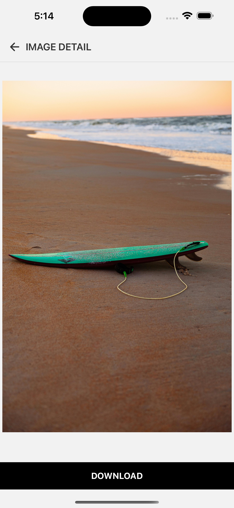

# Wallpaper Download App

React Native로 개발된 배경화면 갤러리 앱입니다. Expo를 기반으로 하며, 이미지 목록 조회와 다운로드 기능을 제공합니다.

## 화면

| 홈 | 즐겨찾기 | 상세 - 즐겨찾기 기능 |
|---|---|---|
|  |  |  |
| 상세 - 다운로드 | 상세 - 다운로드 완료 | |
|  |  | |

## 주요 기능

- **이미지 갤러리**
- **이미지 상세보기**: 개별 이미지 확대 보기 및 상세 정보
- **이미지 다운로드**: 디바이스 사진 앨범에 이미지 저장 기능
- **탭 내비게이션**: Bottom Tab을 통한 직관적인 화면 전환

## 신규 기술 스택

### Navigation
- **React Navigation**: 화면 네비게이션 관리
- **Bottom Tabs**: 탭 기반 네비게이션
- **Stack Navigation**: 스택 기반 화면 전환

### Media & File System
- **expo-file-system**: 파일 다운로드 및 관리
- **expo-media-library**: 디바이스 미디어 라이브러리 접근

### Redux

- **Redux, react-redux**: 전역 상태 관리에 사용 


## 프로젝트 구조

```
app/
├── _layout.tsx                    # 루트 레이아웃
└── src/
    ├── components/               			# 재사용 가능한 컴포넌트
    │   └── PhotoListItem.tsx    				# 이미지 리스트 아이템
    ├── data/                    				# 데이터 및 상수
    │   └── constants.ts         				# 이미지 URL 목록
    ├── designsystem/            				# 디자인 시스템 컴포넌트
    │   ├── Badge.tsx
    │   ├── Button.tsx					 				# 버튼
    │   ├── Divider.tsx
    │   ├── Header.tsx									# 사용
    │   ├── Icons.tsx										# 아이콘 모음
    │   ├── LocalImage.tsx
    │   ├── RemoteImage.tsx							# 네트워킹 이미지 다운로드
    │   ├── Spacer.tsx
    │   ├── TabIcon.tsx									# 하단 탭 아이콘에 사용
    │   └── Typography.tsx							# 사용
    ├── hooks/                   				# 커스텀 훅
    │   ├── useImageDetail.ts    				# 이미지 상세, 다운로드 로직
    │   └── useBottomTabNavigation.ts  	# 하단 탭 관련 로직
    │   └── usePhotoListItem.ts  				# 리스트 아이템 상태 관리
    │   └── useFavoriteImageList.ts  		# 즐겨찾기 화면 로직, 상태 관리
    ├── navigation/              				# 네비게이션 설정
    │   ├── BottomTabNavigations.tsx		# BottomTab
    │   └── RootStackNavigations.tsx		# 최상위에 설정
    │   └── RootStackNavigation.ts			# NativeStackNavigationProp 사용
    └── screen/                  				# 화면 컴포넌트
        ├── ImageListScreen.tsx      		# 이미지 목록 화면
        ├── ImageDetailScreen.tsx    		# 이미지 상세 화면
        ├── FavoriteImageListScreen.tsx # 즐겨찾기 화면
        └── components/
            └── DownloadButton.tsx   		# 다운로드 버튼
    └── actions/                  			# Redux actions
    └── reducers/                  			# Redux reducers
    └── store/                  				# Redux store
```


## 주요 기능 구현

### 주요 특징:
- **권한 관리**: 미디어 라이브러리 접근 권한 자동 요청
  - 권한 확인 및 요청 -> 이미지 다운로드 -> 앨범에 저장

- **에러 처리**: 다운로드 실패 시 사용자 친화적 알림
- **로딩 상태**: 이미지 다운로드 진행 상태 UI 피드백
- **파일 시스템**: Expo File System을 활용한 안전한 파일 다운로드

## 학습 내용 정리

이 프로젝트를 통해 학습할 수 있는 React Native 개발 개념들:

### 1. Navigation
- React Navigation 설정 및 사용
- Stack Navigation과 Tab Navigation 조합
- 타입 안정성을 고려한 네비게이션 파라미터 관리

### 2. File System & Media
- Expo File System API 사용
- 미디어 라이브러리 권한 관리
- 네트워크 이미지 다운로드

### 3. Design System
- React.FC 사용
```tsx
export const Header: React.FC<HeaderProps> & {
  Title: React.FC<HeaderTitleProps>;
  Icon: React.FC<HeaderIconProps>;
} = ({ children }) => {
  return (
    <SafeAreaView style={styles.container}>
      <View style={styles.headerContainer}>{children}</View>
    </SafeAreaView>
  );
};

```


### 4. Performance Optimization
- FlatList를 활용한 효율적인 리스트 렌더링

## Redux 구현

앱의 즐겨찾기 기능을 위한 전역 상태 관리에 Redux를 사용합니다.

```bash
yarn add redux react-redux @reduxjs/toolkit
```

- redux: reducers 에서 사용
- react-redux: useDispatch, useSelector
- @reduxjs/toolkit: configureStore(store)

### 아키텍처 구조

```
src/
├── actions/
│   └── favorite.ts       # 즐겨찾기 액션 정의
├── reducers/
│   └── favoriteReducer.ts  # 즐겨찾기 상태 관리 리듀서
└── store/
    └── store.ts          # Redux 스토어 설정
```

### 1. Actions (actions/favorite.ts)
```typescript
export const ACTION_CLICKED_FAVORITE = "ACTION_CLICKED_FAVORITE";

export const onClickFavorite = (clickedItem: string) => {
  return {
    type: ACTION_CLICKED_FAVORITE,
    clicked: clickedItem,
  };
};
```
- 즐겨찾기 토글 액션 생성자 함수
- 클릭된 이미지의 ID를 페이로드로 전달

### 2. Reducer (reducers/favoriteReducer.ts:21-57)
```typescript
const favoriteReducer = (state = initialState, action: FavoriteAction) => {
  switch (action.type) {
    case ACTION_CLICKED_FAVORITE:
      if ('clicked' in action && typeof action.clicked === 'string') {
        const hasItem = state.favorites.includes(action.clicked);
        
        if (hasItem) {
          // 즐겨찾기에서 제거
          const favorites = state.favorites.filter(
            (item: string) => item !== action.clicked
          );
          return { ...state, favorites };
        } else {
          // 즐겨찾기에 추가
          return {
            ...state,
            favorites: [...state.favorites, action.clicked],
          };
        }
      }
      return state;
    default:
      return state;
  }
};
```

**주요 특징:**
- **토글 방식**: 이미 즐겨찾기에 있으면 제거, 없으면 추가
- **불변성 유지**: spread 연산자와 filter를 사용한 상태 업데이트
- **타입 안전성**: TypeScript를 활용한 액션 타입 검증

### 3. Store 설정 (store/store.ts:4-11)
```typescript
const store = configureStore({
  reducer: {
    favorite: favoriteReducer,
  },
});

export type RootState = ReturnType<typeof store.getState>;
```
- **Redux Toolkit** 사용으로 간편한 스토어 설정
- TypeScript 지원을 위한 **RootState** 타입 추출

### 사용 예시
```typescript
// 컴포넌트에서 Redux 사용
const favorites = useSelector((state: RootState) => state.favorite.favorites);
const dispatch = useDispatch();

const handleFavoriteClick = (imageId: string) => {
  dispatch(onClickFavorite(imageId));
};
```

### Redux 플로우차트

즐겨찾기 기능의 Redux 데이터 흐름을 시각화한 다이어그램입니다.


### 상세 플로우 설명

1. **사용자 인터랙션**: 하트 버튼 클릭
2. **액션 생성**: `onClickFavorite(imageId)` 호출
3. **액션 디스패치**: `dispatch`를 통해 Store로 전달
4. **리듀서 처리**: `favoriteReducer`에서 `ACTION_CLICKED_FAVORITE` 처리
5. **상태 확인**: `state.favorites.includes(imageId)`로 현재 즐겨찾기 상태 확인
6. **상태 업데이트**: 
   - 있으면 → `filter`로 제거
   - 없으면 → `spread` 연산자로 추가
7. **불변성 유지**: 새로운 객체 반환 `{...state, favorites: newFavorites}`
8. **컴포넌트 업데이트**: `useSelector` 구독 컴포넌트들 자동 리렌더링
